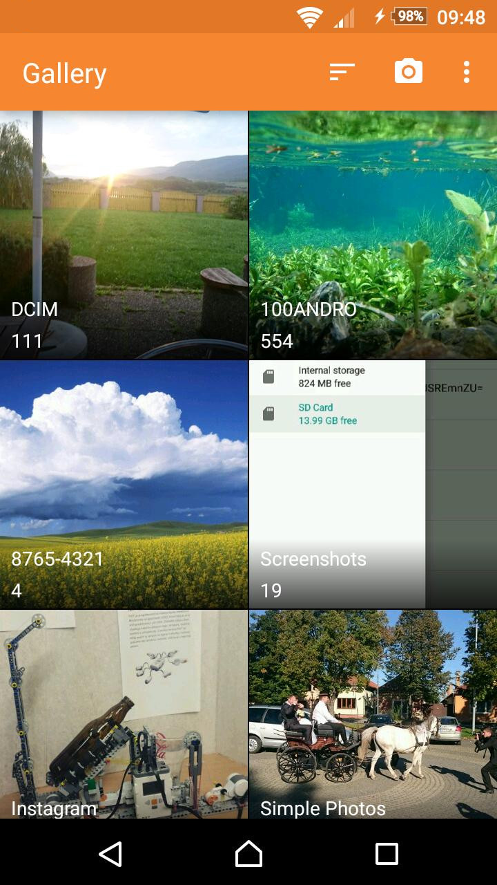
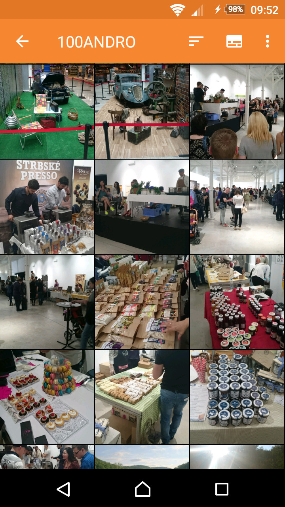
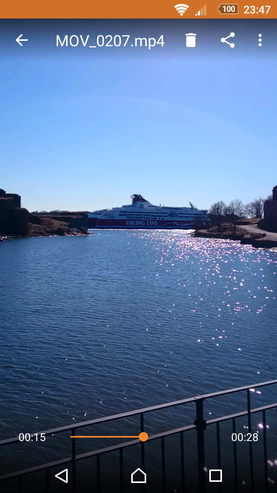

# Simple Gallery

A gallery for viewing photos and videos.

A simple tool usable for viewing photos and videos. Items can be sorted by date, size, name both ascending or descending, photos can be zoomed in. Media files are shown in multiple columns depending on the size of the display, you can change the column count by pinch gestures. They can be renamed, shared, deleted, copied, moved. Images can also be cropped, rotated, flipped or set as Wallpaper directly from the app.

   
